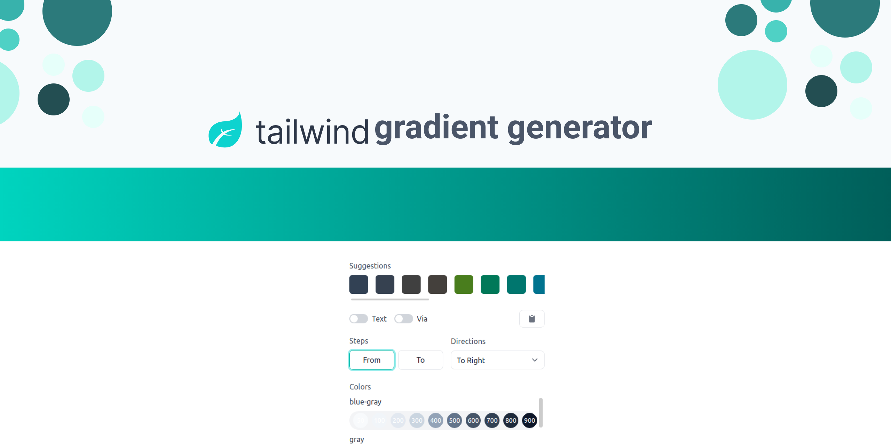

<p align="center">
    

## Tailwind Components Gradient Generator
This repo content a Gradient Generator page from [tailwindcompnents.com](https://tailwindcomponents.com/gradient-generator/), Build with Vuejs.

<a href="https://github.com/tailwindcomponents/gradient-generator/blob/main/LICENSE">
    
</a>

<a href="https://github.com/tailwindcomponents/gradient-generator/stargazers">
    
</a>

<a href="https://twitter.com/TwComponents">
    
</a>

### Project setup
```
yarn install
```

### Compiles and hot-reloads for development
```
yarn serve
```

### Compiles and minifies for production
```
yarn build
```

### Lints and fixes files
```
yarn lint
```

### Customize configuration
See [Configuration Reference](https://cli.vuejs.org/config/).
