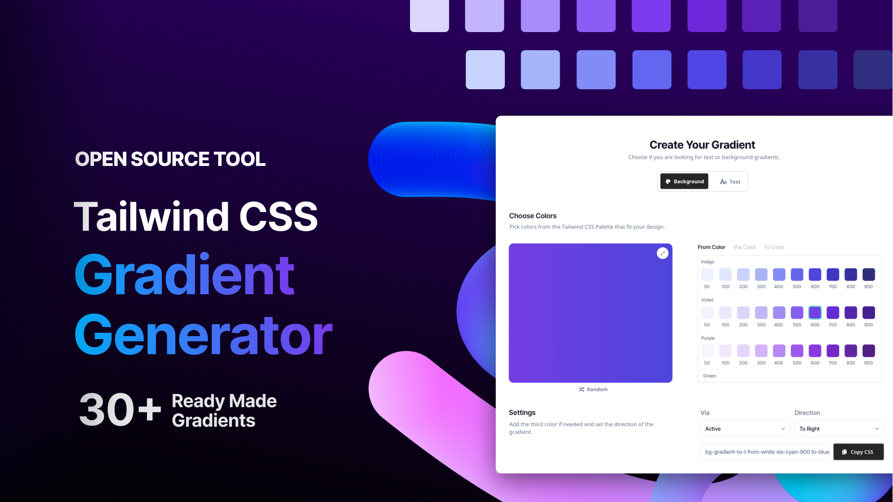

<p align="center">
    </p>

## Tailwind Components Gradient Generator
This repo content a Gradient Generator page from [tailwindcomponents.com](https://tailwindcomponents.com/gradient-generator/), Build with Vuejs.

<a href="https://github.com/tailwindcomponents/gradient-generator/blob/main/LICENSE">
    
</a>

<a href="https://github.com/tailwindcomponents/gradient-generator/stargazers">
    
</a>

<a href="https://twitter.com/TwComponents">
    
</a>

## Installation

### Install NPM dependency

```
npm install 

OR

yarn install
```

### Compiles and hot-reloads for development
```
npm run dev

OR

yarn dev
```

### Compiles and minifies for production
```
npm run build

OR

yarn build
```

### Vue 3 + Vite

This template should help get you started developing with Vue 3 in Vite. The template uses Vue 3 `<script setup>` SFCs, check out the [script setup docs](https://v3.vuejs.org/api/sfc-script-setup.html#sfc-script-setup) to learn more.

### Recommended IDE Setup

- [VS Code](https://code.visualstudio.com/) + [Volar](https://marketplace.visualstudio.com/items?itemName=Vue.volar)
